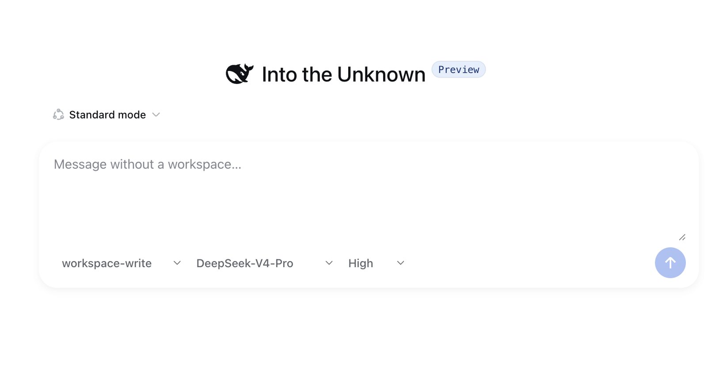
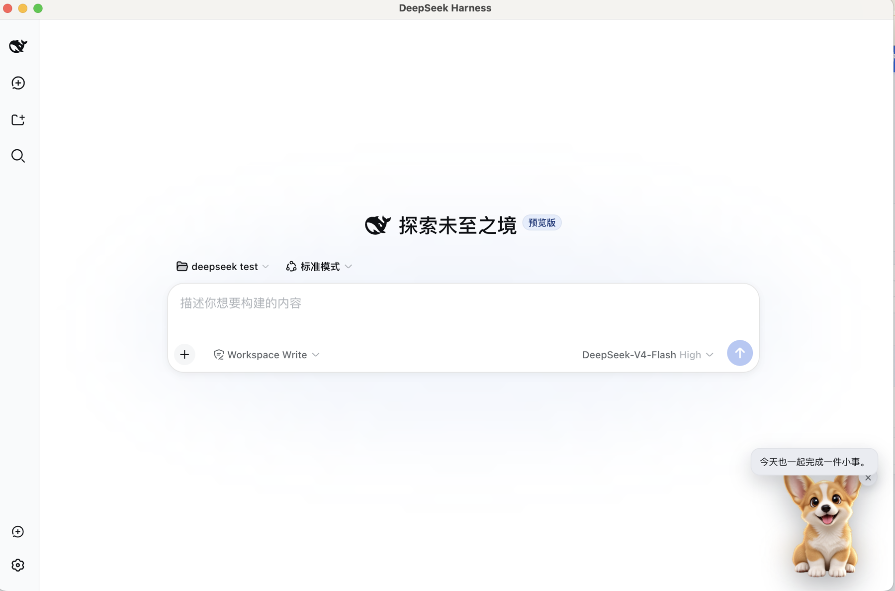
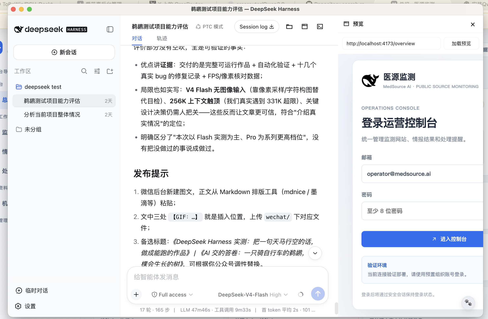
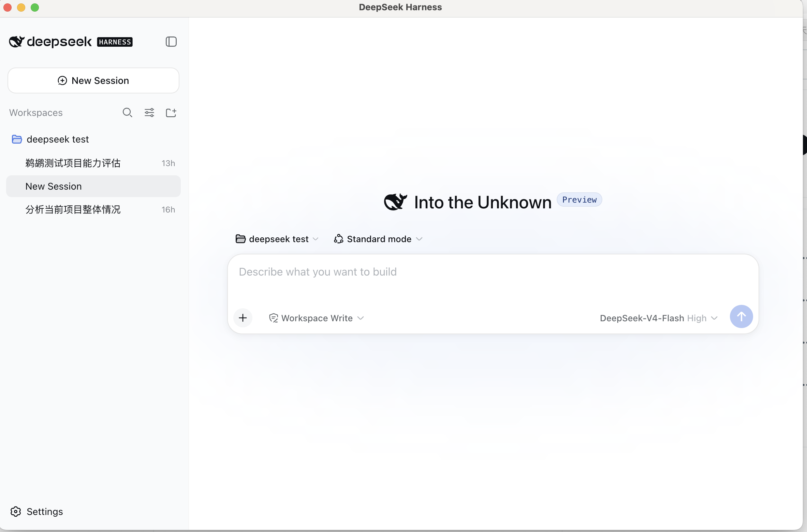

<h1 align="center">DSH Plugin Market</h1>

<p align="center">
  A local-first plugin manager—and the front door to the ToBeWin ecosystem for DeepSeek Harness.
</p>

<p align="center">
  <a href="https://www.npmjs.com/package/@tobewin/dsh-plugin-market"></a>
  <a href="https://github.com/ToBeWin/DSH-Plugin-Market/blob/main/LICENSE"></a>
  
  
</p>

<p align="center">
  <a href="#quick-start">Quick start</a> ·
  <a href="#the-tobewin-dsh-suite">Plugin suite</a> ·
  <a href="#中文说明">中文说明</a> ·
  <a href="https://github.com/ToBeWin">ToBeWin on GitHub</a>
</p>

`@tobewin/dsh-plugin-market` adds a native-looking **Plugin Market** page to [DeepSeek Harness](https://github.com/deepseek-ai/deepseek-harness), where you can inspect and maintain the plugins installed in the active profile.

It is deliberately **not** a hosted marketplace: no catalog service, user account, analytics, telemetry, or remote database is involved. Everything is read from and changed on the local DSH profile through the official `dsh plugin` command.

> This is an independent community project by [ToBeWin](https://github.com/ToBeWin). It is not affiliated with or endorsed by DeepSeek.

## The ToBeWin DSH suite

Each project owns one focused capability and remains independently installable. None of them forks or bundles the DeepSeek Harness source tree.

| Project | What it adds | Package |
| --- | --- | --- |
| **Plugin Market** | Install, update, enable, disable, and remove local plugins | `@tobewin/dsh-plugin-market` |
| [**Temporary Chat**](https://github.com/ToBeWin/DSH-Temporary-Chat) | Start a native conversation without choosing a workspace | `@tobewin/dsh-temporary-chat` |
| [**Skin Studio**](https://github.com/ToBeWin/DSH-Skin-Studio) | Built-in skins, custom colors, wallpapers, and visual cropping | `@tobewin/dsh-skin-studio` |
| [**Pet Companion**](https://github.com/ToBeWin/DSH-Pet-Companion) | Sixteen animated, local-only companions with bilingual greetings | `@tobewin/dsh-pet-companion` |
| [**Developer Workbench**](https://github.com/ToBeWin/DSH-Developer-Workbench) | Project files, embedded web preview, and an interactive PTY terminal | `@tobewin/dsh-developer-workbench` |
| [**DSH Desktop**](https://github.com/ToBeWin/DSH-Desktop) | A decoupled macOS and Windows desktop host | GitHub Releases |

## The suite in action / 实际运行效果

Every image below is a real DeepSeek Harness screen captured from the corresponding project. No conceptual dashboard or fictional interface is shown.

以下全部来自相应项目的真实 DeepSeek Harness 运行界面，不使用概念控制台或虚构产品画面。

<table>
  <tr>
    <td width="50%" valign="top">
      <a href="https://github.com/ToBeWin/DSH-Temporary-Chat"></a><br>
      <strong>Temporary Chat</strong> — start without choosing a workspace.<br>
      <strong>临时会话</strong> —— 无需先选择工作区。
    </td>
    <td width="50%" valign="top">
      <a href="https://github.com/ToBeWin/DSH-Skin-Studio"></a><br>
      <strong>Skin Studio</strong> — wallpapers, palettes, translucency, and framing.<br>
      <strong>皮肤工作室</strong> —— 背景图、配色、透明度与裁剪。
    </td>
  </tr>
  <tr>
    <td width="50%" valign="top">
      <a href="https://github.com/ToBeWin/DSH-Pet-Companion"></a><br>
      <strong>Pet Companion</strong> — animated local characters with bilingual greetings.<br>
      <strong>萌宠伴侣</strong> —— 会使用中英文打招呼的本地动态角色。
    </td>
    <td width="50%" valign="top">
      <a href="https://github.com/ToBeWin/DSH-Developer-Workbench"></a><br>
      <strong>Developer Workbench</strong> — files, live preview, and an interactive terminal.<br>
      <strong>开发工作台</strong> —— 文件、实时预览与交互终端。
    </td>
  </tr>
</table>

<p align="center">
  <a href="https://github.com/ToBeWin/DSH-Desktop"></a><br>
  <strong>DSH Desktop</strong> — the original Harness Web UI in a decoupled macOS and Windows desktop host.<br>
  独立封装原版 Harness Web UI 的 macOS 与 Windows 桌面端。
</p>

## What it does

- Adds a first-level **Plugin Market** entry to DSH Settings.
- Lists installed plugin packages, versions, sources, and enabled state.
- Enables or disables a plugin bundle for the active profile.
- Installs, updates, and removes packages by delegating to the official DSH plugin command.
- Runs its visual dashboard on `127.0.0.1` only; it never exposes a server to the LAN or Internet.
- Follows the English/Chinese language selected in Harness Settings.

## Quick start

```bash
dsh plugin --profile web add @tobewin/dsh-plugin-market
```

Restart the DSH Web Host after installation. Open **Settings → Plugin Market** to manage the plugins in that profile. Replace `web` with another profile name when needed.

### Development install

```bash
git clone https://github.com/ToBeWin/DSH-Plugin-Market.git
cd DSH-Plugin-Market
pnpm install
pnpm build
dsh plugin --profile web add .
```

Restart the Web Host after adding, removing, enabling, or disabling a plugin.

## Command line usage

```bash
pnpm build
node lib/cli.js list --profile web
node lib/cli.js disable @scope/plugin --profile web
node lib/cli.js enable @scope/plugin --profile web
node lib/cli.js update @scope/plugin --profile web
node lib/cli.js remove @scope/plugin --profile web --yes
node lib/cli.js serve --profile web
```

`install`, `update`, and `remove` use the installed `dsh plugin` command rather than a second package-management implementation. This keeps DSH responsible for dependency resolution and bundle reconciliation. `remove` requires `--yes` to avoid accidental dependency changes.

## Local-only architecture

The dashboard reads `$DSH_HOME/profiles/<profile>/package.json` and the profile's DSH bundle list. Its server binds to `127.0.0.1:39183` only. No profile information is sent to ToBeWin or any other service.

The browser integration uses public DSH locale and Settings extension points. The actual package mutations remain official DSH CLI operations.

## Compatibility and limitations

- Designed for the current DeepSeek Harness Web Host plugin model.
- Plugin mutations take effect after restarting DSH.
- The page manages installed packages; it does not operate a public discovery catalog or make trust claims about third-party packages.
- Review a package's repository and permissions before installing it.

## Development

```bash
pnpm install
pnpm check
pnpm build
```

For a local dashboard after installation:

```bash
pnpm --dir "$DSH_HOME/profiles/web" exec dsh-plugin-market serve --profile web
```

If `dsh` is not available on your shell `PATH`, set `DSH_BIN` to its executable path before running install, update, or remove operations.

## Contributing

Issues and pull requests are welcome. Please include your DSH version, profile name (with private paths removed), and a reproducible description. Do not include API keys, tokens, or the full contents of private profile files.

## License

[MIT](LICENSE) © ToBeWin

---

## 中文说明

`@tobewin/dsh-plugin-market` 是 [DeepSeek Harness](https://github.com/deepseek-ai/deepseek-harness) 的本地优先插件管理工具。它会在 Harness 设置中增加 **插件市场** 页面，用于查看和维护当前 Profile 已安装的插件。

它**不是**在线插件商店：没有云端目录、账号、遥测、统计或远程数据库。所有信息都从本机 DSH Profile 读取，安装、更新和卸载仍由官方 `dsh plugin` 命令执行。

> 本项目由 [ToBeWin](https://github.com/ToBeWin) 独立维护，与 DeepSeek 无隶属或官方背书关系。

### 功能

- 在 DSH 设置中加入一级入口 **插件市场**。
- 显示已安装插件的版本、来源与启用状态。
- 为当前 Profile 启用或停用插件 Bundle。
- 调用官方 DSH 插件命令执行安装、更新与卸载。
- 管理页面仅监听本机回环地址 `127.0.0.1`，不会对局域网或互联网开放服务。
- 自动跟随 Harness 设置中的中文 / English 切换。

### 安装

从 npm 安装：

```bash
dsh plugin --profile web add @tobewin/dsh-plugin-market
```

安装后重启 DSH Web Host，在 **设置 → 插件市场** 中打开。`web` 可替换成你的 Profile 名称。

本地开发安装：

```bash
git clone https://github.com/ToBeWin/DSH-Plugin-Market.git
cd DSH-Plugin-Market
pnpm install
pnpm build
dsh plugin --profile web add .
```

插件的安装、更新、卸载、启用或停用后，都需要重启 DSH 才会生效。

### 本地与安全边界

插件只读取 `$DSH_HOME/profiles/<profile>/package.json` 和对应的 Bundle 配置；可视化服务仅运行在 `127.0.0.1:39183`。不会把 Profile、插件列表或其他数据上传给 ToBeWin 或第三方服务。

本插件使用公开的 DSH 设置与语言扩展点；依赖变更始终委托给官方 CLI。请在安装第三方插件前自行审阅其仓库与权限。

### 开发与贡献

```bash
pnpm install
pnpm check
pnpm build
```

欢迎提交 Issue 和 PR。反馈问题时请说明 DSH 版本、Profile 名称（请去除私有路径）和复现步骤；不要提交 API Key、Token 或完整私有配置文件。

### 许可证

[MIT](LICENSE) © ToBeWin
